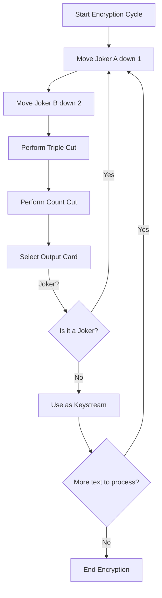
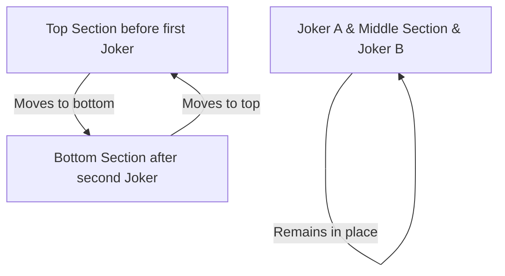
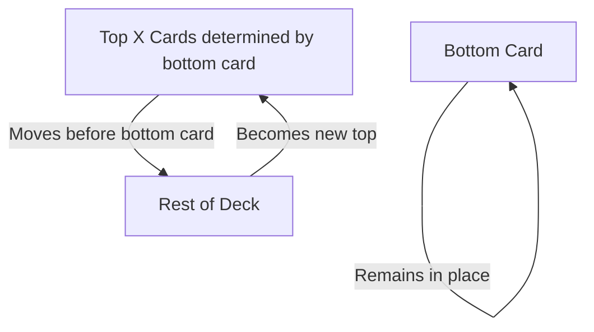

# 📖 Pontifex Cipher (Solitaire) – Swift & Go Implementation

A cross-platform implementation of the **Pontifex Cipher** (aka **Solitaire**) from Neal Stephenson’s *Cryptonomicon*, written in **Swift** and **Go**. This project demonstrates how to encrypt and decrypt messages using a **deck of cards** as the cryptographic key.

---

## 🔍 **What is the Pontifex Cipher?**

The **Pontifex Cipher**, designed by Bruce Schneier for *Cryptonomicon*, is a manual cryptographic algorithm that uses a **deck of 54 playing cards** (52 standard + 2 Jokers) to generate a keystream. Each keystream value is combined with plaintext to produce ciphertext and vice versa.

It is notable for:
- Being **secure enough** for field use with just a deck of cards.
- Having **no reliance on computers**—a purely **manual** encryption system.
- Being **fun to use**—and a great introduction to cryptography.

If you haven’t read *Cryptonomicon*, stop everything and go read it. Seriously. 📖

---

## 🃏 **How the Cipher Works**

The cipher follows a series of steps to transform a deck into a keystream generator:

1. **Move Joker A** down one position.
2. **Move Joker B** down two positions.
3. **Triple Cut** (swap sections of the deck above and below the jokers).
4. **Count Cut** based on the value of the bottom card.
5. **Select Output Card**:
   - Use the top card’s value to find the keystream card.
   - If the selected card is a Joker, repeat the process.
6. **Repeat** until enough keystream values are generated.

### 🔢 **Mermaid Diagram of the Algorithm**


### 🎬 **Triple Cut Visualization**


### 🎬 **Count Cut Visualization**


---

## 🚀 **Features of This Implementation**
✅ **Implemented in Swift and Go** for cross-platform support.  
✅ **Uses a JSON file** for the deck, making it easy to save, share, and reuse keys.  
✅ **Generates a random deck** via CLI for easy encryption.  
✅ **Command-line interface** for encryption and decryption.  
✅ **Faithful implementation** of *Cryptonomicon’s* Pontifex cipher.  

---

## ⚙️ **Installation & Compilation**

### **Swift Version**
#### **Compile:**
```bash
swift build -c release
```
#### **Run Examples:**
```bash
.build/release/pontifex --generate my_deck.json
.build/release/pontifex -e "HELLO WORLD" --deck my_deck.json
.build/release/pontifex -d "ENCODED TEXT" --deck my_deck.json
```

### **Go Version**
#### **Compile:**
```bash
go build pontifex.go
```
#### **Run Examples:**
```bash
./pontifex --generate my_deck.json
./pontifex -e "HELLO WORLD" --deck my_deck.json
./pontifex -d "ENCODED TEXT" --deck my_deck.json
```

---

## 🛠 **Usage**

### **Generate a Random Deck**
```bash
./pontifex --generate deck.json
```
Creates a randomized deck and saves it as `deck.json`.

### **Encrypt a Message**
```bash
./pontifex -e "HELLO WORLD" --deck deck.json
```
Encrypts the plaintext message using the provided deck.

### **Decrypt a Message**
```bash
./pontifex -d "CIPHERTEXT" --deck deck.json
```
Decrypts the message using the same deck order.

---

## 📚 **Read *Cryptonomicon***

For those fascinated by cryptography, history, and amazing storytelling, Neal Stephenson’s *Cryptonomicon* is a must-read. It dives deep into WWII cryptography, modern infosec, and features **one of the best depictions of a realistic cipher in fiction**.

[📖 *Cryptonomicon* by Neal Stephenson](https://www.nealstephenson.com/cryptonomicon.html)

---

## 📄 **License**

This project is licensed under the MIT License—see the `LICENSE` file for details.

