# 📖 Pontifex Cipher (Solitaire) – Swift & Go Implementation

A cross-platform implementation of the **Pontifex Cipher** (aka **Solitaire**) from Neal Stephenson's *Cryptonomicon*, written in **Swift** and **Go**. This project demonstrates how to encrypt and decrypt messages using a **deck of cards** as the cryptographic key.

---

## 🔍 **What is the Pontifex Cipher?**

The **Pontifex Cipher**, designed by Bruce Schneier for *Cryptonomicon*, is a manual cryptographic algorithm that uses a **deck of 54 playing cards** (52 standard + 2 Jokers) to generate a keystream. Each keystream value is combined with plaintext to produce ciphertext and vice versa.

It is notable for:
- Being **secure enough** for field use with just a deck of cards.
- Having **no reliance on computers**—a purely **manual** encryption system.
- Being **fun to use**—and a great introduction to cryptography.

If you haven't read *Cryptonomicon*, stop everything and go read it. Seriously. It's a masterful blend of historical fiction and modern-day cyberthriller that will forever change how you think about cryptography, privacy, and the digital age. Neal Stephenson weaves together WWII codebreaking, modern information security, and a grand adventure spanning generations. The Pontifex cipher is just one of many fascinating elements that make this book a must-read for any technology enthusiast.

---

## 🎲 **Complete Algorithm Overview**

Here's a high-level overview of how the Pontifex Cipher works:


### 🎴 **Initial Setup**

Before we begin, we need to assign values to each card in the deck:

```mermaid
classDiagram
    class CardValues {
        Clubs(♣️): 1-13
        Diamonds(♦️): 14-26
        Hearts(♥️): 27-39
        Spades(♠️): 40-52
        Jokers: 53
    }
    
    class Clubs {
        A♣️: 1
        2♣️: 2
        3♣️: 3
        ...
        J♣️: 11
        Q♣️: 12
        K♣️: 13
    }
    
    class Diamonds {
        A♦️: 14
        2♦️: 15
        3♦️: 16
        ...
        J♦️: 24
        Q♦️: 25
        K♦️: 26
    }
    
    class Hearts {
        A♥️: 27
        2♥️: 28
        3♥️: 29
        ...
        J♥️: 37
        Q♥️: 38
        K♥️: 39
    }
    
    class Spades {
        A♠️: 40
        2♠️: 41
        3♠️: 42
        ...
        J♠️: 50
        Q♠️: 51
        K♠️: 52
    }
    
    CardValues <|-- Clubs
    CardValues <|-- Diamonds
    CardValues <|-- Hearts
    CardValues <|-- Spades
```



### 🔄 **Keystream Generation Steps**

#### 📊 **Step 1-2: Move the Jokers**

```mermaid
sequenceDiagram
    participant Deck as Card Deck
    Note over Deck: Initial state
    Note over Deck: ... 7♥️ 4♦️ JOKER_A 9♠️ ...
    Deck->>Deck: Move Joker A down 1 position
    Note over Deck: ... 7♥️ 4♦️ 9♠️ JOKER_A ...
    Deck->>Deck: Move Joker B down 2 positions
    Note over Deck: ... 10♣️ JOKER_B 5♦️ Q♥️ ...
    Note over Deck: becomes
    Note over Deck: ... 10♣️ 5♦️ Q♥️ JOKER_B ...
```



**Special cases:**
- If Joker A is at the bottom, it wraps to position 1 (just after the top card)
- If Joker B is at the bottom, it wraps to position 2
- If Joker B is second-to-last, it wraps to position 1

#### 📊 **Step 3: Triple Cut**


The order of the jokers doesn't matter - just find the topmost and bottommost joker.

#### 📊 **Step 4: Count Cut**

```mermaid
sequenceDiagram
    participant Deck as Card Deck
    Note over Deck: Initial state
    Note over Deck: [ A B C D E ] [ 5♣️ ]
    Note over Deck: Bottom card value = 5
    
    Deck->>Deck: Count 5 cards from top
    Note over Deck: [ A B C D E ] [ 5♣️ ]
    Note over Deck: 1 2 3 4 5
    
    Deck->>Deck: Move counted cards before bottom card
    Note over Deck: After count cut
    Note over Deck: [ ] [ A B C D E ] [ 5♣️ ]
```



The bottom card always stays at the bottom.

#### 📊 **Step 5: Find Output Card**


If the card value is > 26, subtract 26 to get a value between 1-26.

### 🔐 **Encryption and Decryption**


---

## 🃏 **Manual Encryption Example With a Full Deck**

Let's walk through a complete manual encryption example with a full deck of cards. We'll encrypt the message: **"CRYPTONOMICON"**.

### 📋 **Initial Deck Setup**

We'll use a "keyed" deck, which means we start with a pre-arranged order. In practice, this would be your secret key.

For this example, let's use this deck arrangement (cards listed from top to bottom):

```
A♠️, 2♠️, 3♠️, 4♠️, 5♠️, 6♠️, 7♠️, 8♠️, 9♠️, 10♠️, J♠️, Q♠️, K♠️, 
A♥️, 2♥️, 3♥️, 4♥️, 5♥️, 6♥️, 7♥️, 8♥️, 9♥️, 10♥️, J♥️, Q♥️, K♥️, 
A♦️, 2♦️, 3♦️, 4♦️, 5♦️, 6♦️, 7♦️, 8♦️, 9♦️, 10♦️, J♦️, Q♦️, K♦️, 
A♣️, 2♣️, 3♣️, 4♣️, 5♣️, 6♣️, 7♣️, 8♣️, 9♣️, 10♣️, J♣️, Q♣️, K♣️, 
JOKER_A, JOKER_B
```

### 📝 **The Encryption Process: Step by Step**

Here's a timeline view of how the first few letters get encrypted:


Continuing this process for each letter, we'll eventually get a complete ciphertext. The full calculation would be:

| Letter | Value | Keystream | Sum | Ciphertext |
|--------|-------|-----------|-----|------------|
| C      | 3     | 21        | 24  | X          |
| R      | 18    | 4         | 22  | V          |
| Y      | 25    | 6         | 31→5| E          |
| P      | 16    | 13        | 29→3| C          |
| T      | 20    | 22        | 42→16| P         |
| O      | 15    | 17        | 32→6| F          |
| N      | 14    | 24        | 38→12| L         |
| O      | 15    | 8         | 23  | W          |
| M      | 13    | 19        | 32→6| F          |
| I      | 9     | 5         | 14  | N          |
| C      | 3     | 11        | 14  | N          |
| O      | 15    | 10        | 25  | Y          |
| N      | 14    | 15        | 29→3| C          |

So "CRYPTONOMICON" encrypts to "**XVECPFLWFNNYC**"

### 📝 **Decryption Process**

To decrypt, we would:
1. Start with the same initial deck arrangement
2. Generate the same keystream
3. Subtract each keystream value from the corresponding ciphertext letter value
4. Add 26 if the result is less than 1

For example, to decrypt the first letter "X":
- X = 24
- Keystream = 21
- 24 - 21 = 3
- 3 = C

Repeating for each letter would give us back "CRYPTONOMICON".

---

## 🚀 **Features of This Implementation**
✅ **Implemented in Swift and Go** for cross-platform support.  
✅ **Uses a JSON file** for the deck, making it easy to save, share, and reuse keys.  
✅ **Generates a random deck** via CLI for easy encryption.  
✅ **Command-line interface** for encryption and decryption.  
✅ **Faithful implementation** of *Cryptonomicon's* Pontifex cipher.  

---

## ⚙️ **Installation & Compilation**

### **Swift Version**
#### **Compile:**
```bash
swift build -c release
```
#### **Run Examples:**
```bash
.build/release/pontifex --generate my_deck.json
.build/release/pontifex -e "HELLO WORLD" --deck my_deck.json
.build/release/pontifex -d "ENCODED TEXT" --deck my_deck.json
```

### **Go Version**
#### **Compile:**
```bash
go build pontifex.go
```
#### **Run Examples:**
```bash
./pontifex --generate my_deck.json
./pontifex -e "HELLO WORLD" --deck my_deck.json
./pontifex -d "ENCODED TEXT" --deck my_deck.json
```

---

## 🛠 **Usage**

### **Generate a Random Deck**
```bash
./pontifex --generate deck.json
```
Creates a randomized deck and saves it as `deck.json`.

### **Encrypt a Message**
```bash
./pontifex -e "HELLO WORLD" --deck deck.json
```
Encrypts the plaintext message using the provided deck.

### **Decrypt a Message**
```bash
./pontifex -d "CIPHERTEXT" --deck deck.json
```
Decrypts the message using the same deck order.

---

## 🎮 **Additional Tips for Manual Use**

If you're using physical cards:

1. **Mark your jokers** distinctly as "A" and "B" to avoid confusion
2. **Practice the count cut** as it's the trickiest part for beginners
3. **Keep track of your place** in the algorithm—missing a step ruins the encryption
4. **Work on a clean surface** where cards can be neatly arranged in rows
5. For longer messages, consider **encrypting in blocks of 5 letters**

Remember that the security of the cipher depends on:
- Keeping your initial deck arrangement secret
- Properly performing each step of the algorithm
- Not reusing the same deck arrangement for multiple messages

---

## 📚 **Read *Cryptonomicon***

For those fascinated by cryptography, history, and amazing storytelling, Neal Stephenson's *Cryptonomicon* is a must-read. It dives deep into WWII cryptography, modern infosec, and features **one of the best depictions of a realistic cipher in fiction**.

The book brilliantly interweaves two timelines:
- World War II era with mathematicians and codebreakers working at Bletchley Park
- Modern-day hackers and entrepreneurs building a data haven

Beyond the fascinating cryptography concepts, the book explores themes of privacy, information security, digital currency (predating Bitcoin), and the long reach of history into the present. It's not just a novel about codes—it's about how information shapes our world.

[📖 *Cryptonomicon* by Neal Stephenson](https://www.nealstephenson.com/cryptonomicon.html)

---

## 📄 **License**

This project is licensed under the MIT License—see the `LICENSE` file for details.